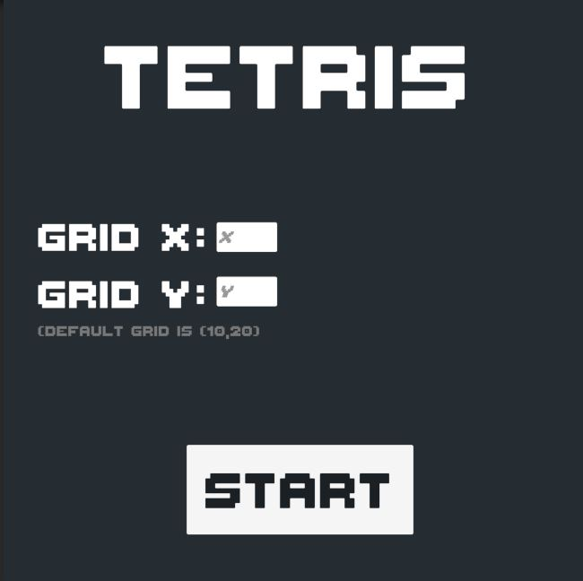
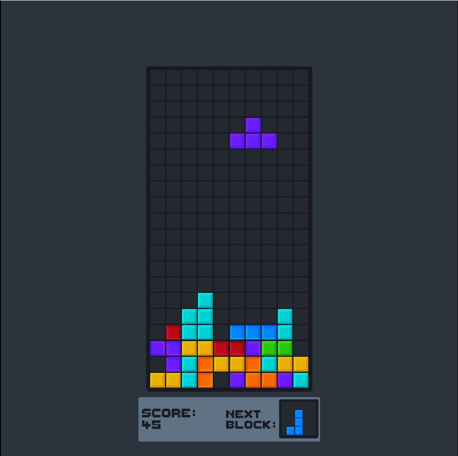
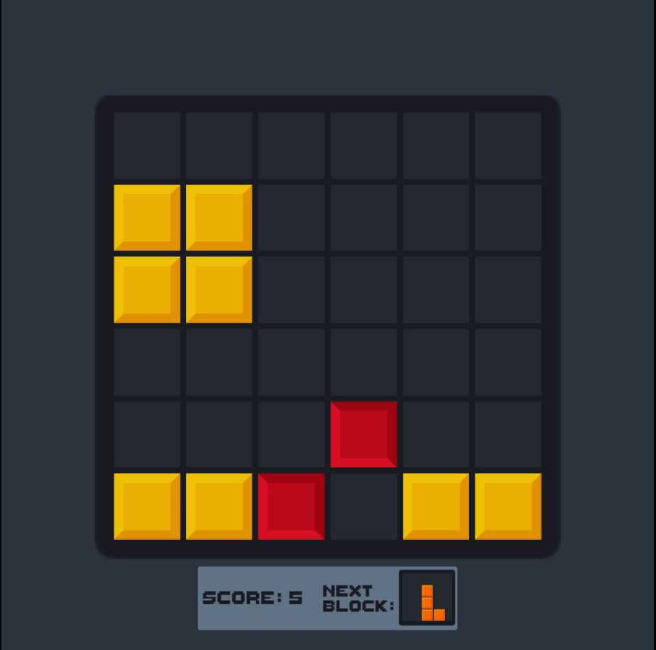
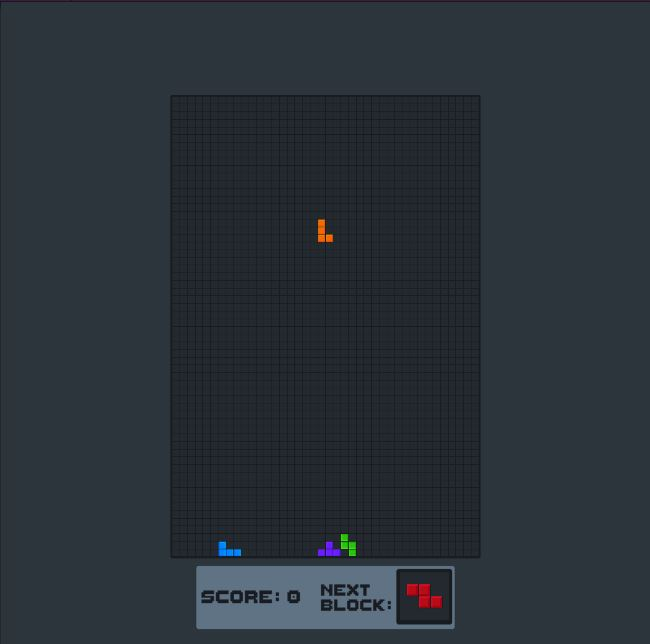
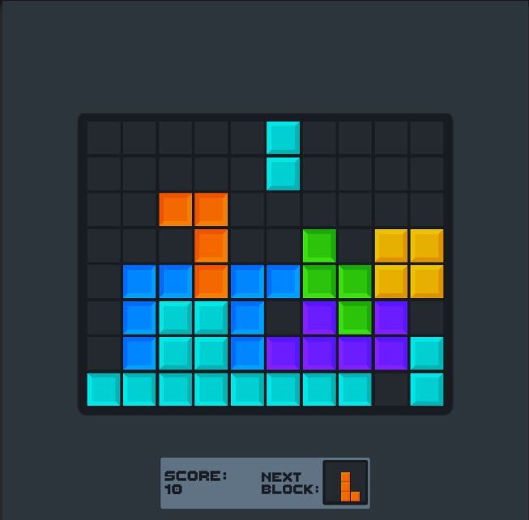
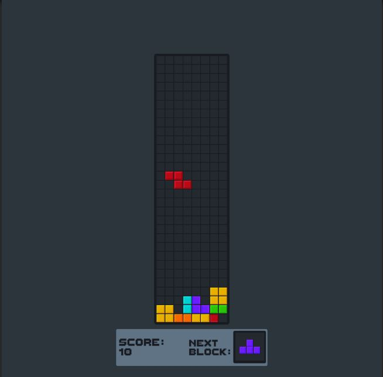

# Tetris-Unity
Gameplay: https://www.youtube.com/watch?v=59PUWzw7Ofo&ab_channel=BatuhanYi%C4%9Fit
The game grid is changeable and resizaable according to the user's preferences (grid x,y should be even). The rest is the typical Tetris game that we all know. Made it with only transform components as it should be.

## Imgs
  
  
  
